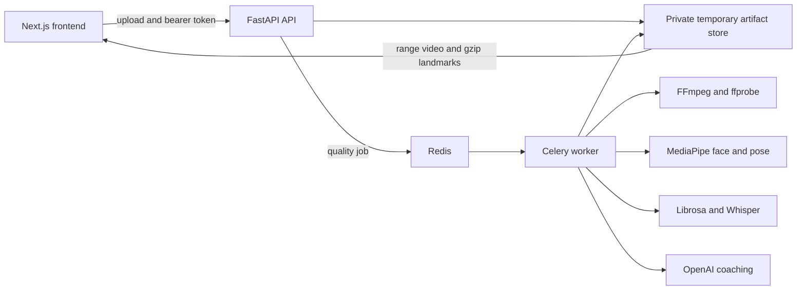

# it'sPEAK

An on-demand, data-driven public-speaking coach for university students preparing for presentations, pitches, interviews, conferences, and keynote-style talks.

Users upload an English-language presentation video of up to three minutes. it'sPEAK checks whether the recording is suitable for analysis, evaluates vocal delivery, facial presence, and body language, then turns the observable results into concrete coaching actions.

> **Development status:** the multimodal analysis pipeline and local results experience are working. Persistent accounts, production storage, full project history, and most archetypes remain staged behind explicit scaffolds.

## Why it'sPEAK

Useful public-speaking feedback is difficult to access:

- **Human coaching is expensive and difficult to scale.**
- **Courses teach general principles but cannot assess an individual's rehearsal.**
- **Self-review is subjective.** Speakers cannot reliably monitor voice, facial presence, posture, gestures, and use of space while delivering a talk.

it'sPEAK is designed to make that feedback available on demand without pretending that geometric measurements are psychological diagnoses or clinical assessments.

## Product Experience

1. Create or select a rehearsal project and its speaking context.
2. Upload a presentation recording of three minutes or less.
3. Pass the pre-analysis quality gate for lighting, framing, face visibility, audio level, clipping, and silence.
4. Confirm any recoverable limitations or re-record when the video cannot support reliable analysis.
5. Follow live job progress while the visual, vocal, transcription, and coaching phases run asynchronously.
6. Review scores, confidence, transcript, coaching priorities, synchronized landmarks, and the eye-contact timeline.
7. Rehearse again and, once persistence is completed, compare progress against the project's calibration session.

## Analysis Modules

### Tonal and Vocal Delivery

- Word-aligned English transcript through OpenAI Whisper
- Speaking pace and pace consistency
- Pitch range and variation through Librosa
- Filler-word frequency
- Strategic and hesitation pause analysis
- Segment-level speech issues and actionable vocal coaching

### Facial Presence

- Eye-contact ratio using iris and eye geometry as a camera-contact proxy
- Expression variation and head stability
- `AU6` and `AU12` geometric proxies relative to a per-recording baseline
- Smile-naturalness proxy, suppressed when face size or orientation is unreliable
- Frame-indexed face landmarks for synchronized client-side overlays
- On-camera, away, and unknown intervals on a seekable timeline

The smile metrics are geometric proxies, not trained FACS action-unit detections and not emotion inference.

### Body Language

- Posture alignment and shoulder stability
- Gesture frequency, range, and openness
- Torso movement classified as `stable`, `purposeful_translation`, `repetitive_shifting`, or `insufficient_data`
- Spatial-use estimate with a stationary-camera limitation
- Partial-visibility and per-metric confidence reporting
- Frame-indexed pose landmarks for the client-side skeleton overlay

Movement feedback describes observable motion only. It does not infer anxiety, confidence, personality, intent, or mental state.

### Coaching

- Archetype-calibrated scores
- Structured cards containing the observed problem, why it matters, and one concrete rehearsal action
- OpenAI coaching with deterministic fallback cards when the provider is unavailable
- Metrics marked `insufficient_data` are excluded and the remaining score inputs are reweighted

## Quality Gate

Full analysis does not start until the recording passes or the user explicitly confirms warning-level limitations.

**Hard rejection**

- Undecodable or spoofed media
- Missing audio
- No consistently detectable primary face
- Duration over three minutes

**Confirmation required**

- Poor lighting, low contrast, or blur
- Face smaller than the configured pixel threshold
- Intermittent face detection or partial body visibility
- Multiple detected faces
- Quiet, clipped, or mostly silent audio

The gate retains raw measurements alongside configurable thresholds so calibration can change without reprocessing the video.

## PRD Progress

| Capability | Status |
| --- | --- |
| Three-minute English video workflow | Implemented |
| Pre-analysis recording quality gate | Implemented |
| Vocal, facial, and body analysis | Implemented |
| Synchronized face, skeleton, and eye-contact review | Implemented |
| Structured OpenAI coaching cards | Implemented |
| Corporate/Board and Motivational/Keynote archetypes | Implemented |
| Startup Pitch, Academic/Conference, Informal/Team, Job Interview, and Custom archetypes | Scaffolded |
| Rule-based archetype recommendation quiz | Planned |
| Project folders and dashboard experience | Frontend prototype |
| Clerk-ready authentication boundary and Supabase persistence | Implemented; Clerk dashboard setup remains |
| Private Supabase retained video storage | Implemented |
| Five-session project limit and protected Session 1 baseline | Implemented |
| Progress deltas, stagnation alerts, Best Session Replay, and Coaching Playbook | Planned |
| Railway/Vercel production deployment | Planned |

## Architecture



Uploads remain in an opaque temporary store while quality checks and analysis run. Successful sessions, reports, coaching cards, videos, and landmark artifacts are committed to Supabase; rejected or failed uploads expire without consuming a project session number.

## Technology

| Layer | Current implementation |
| --- | --- |
| Frontend | Next.js, React, JavaScript, Tailwind CSS, Recharts, Canvas overlays |
| API | FastAPI and Pydantic |
| Background processing | Celery and Redis |
| Video and audio probing | FFmpeg and ffprobe |
| Computer vision | MediaPipe Face Mesh and BlazePose in sequential video mode |
| Vocal analysis | Librosa and NumPy |
| Transcription and coaching | OpenAI Whisper and configurable OpenAI coaching model |
| Local artifacts | Private filesystem store with bearer tokens and 24-hour retention |
| Durable persistence | Supabase Postgres and private Supabase Storage |

## Repository Layout

```text
.
├── backend/
│   ├── itspeak/              # API, workers, quality gate, CV, audio, coaching
│   ├── persistence/          # Supabase-compatible schema scaffold
│   ├── scripts/              # Analysis cadence validation
│   └── tests/                # Backend and security tests
├── frontend/
│   ├── app/                  # Dashboard, project, and results routes
│   ├── components/           # Upload, quality-gate, charts, and video review UI
│   ├── hooks/                # Analysis session state and polling
│   ├── lib/                  # API client, adapters, and overlay timing logic
│   └── tests/                # Overlay synchronization tests
└── README.md
```

## Local Development

### Prerequisites

- Node.js 20 or newer
- Python 3.11
- FFmpeg and ffprobe
- Redis
- An OpenAI API key for live transcription and generated coaching

On macOS with Homebrew:

```bash
brew install python@3.11 ffmpeg redis
brew services start redis
```

On Windows with winget (PowerShell):

```powershell
winget install Python.Python.3.11
winget install Gyan.FFmpeg
winget install OpenJS.NodeJS.LTS
# Redis has no native Windows build. Use Docker Desktop:
docker run -d -p 6379:6379 --name itspeak-redis redis:7
# ...or install Memurai (a Redis-compatible Windows service) instead:
# winget install Memurai.MemuraiDeveloper
```

After installing FFmpeg, open a new terminal and confirm `ffmpeg -version` and
`ffprobe -version` work. If they are not on `PATH`, set `ITSPEAK_FFMPEG_BIN` and
`ITSPEAK_FFPROBE_BIN` in `backend/.env` to their full `.exe` paths.

### Install

macOS / Linux:

```bash
cd backend
python3.11 -m venv .venv
.venv/bin/python -m pip install -r requirements.txt
cp .env.example .env
```

Windows (PowerShell):

```powershell
cd backend
py -3.11 -m venv .venv
.\.venv\Scripts\python.exe -m pip install -r requirements.txt
Copy-Item .env.example .env
```

Set `ITSPEAK_OPENAI_API_KEY` in `backend/.env`. On Windows, also set
`ITSPEAK_ARTIFACT_DIR` to a Windows path (for example
`ITSPEAK_ARTIFACT_DIR=C:\Users\<you>\itspeak-sessions`) since the default
`/tmp/itspeak-sessions` is a Unix path.

macOS / Linux:

Create or link a Supabase project, then apply the migration:

```bash
supabase link --project-ref YOUR_PROJECT_REF
supabase db push
```

Alternatively, paste `backend/persistence/schema.sql` into the Supabase SQL Editor for a new empty project. Set `ITSPEAK_SUPABASE_URL` and the backend-only `ITSPEAK_SUPABASE_SECRET_KEY`. Never place the secret key in a `NEXT_PUBLIC_*` variable.

Local development uses `ITSPEAK_DEV_USER_ID`. Before production, clear that value and implement the Clerk verifier behind `itspeak.auth.get_auth_principal`; the schema already expects the Clerk JWT `sub` claim and `supabase/config.toml` contains the deferred third-party-provider hook.

```bash
cd ../frontend
npm ci
cp .env.example .env.local
```

Windows (PowerShell):

```powershell
cd ..\frontend
npm ci
Copy-Item .env.example .env.local
```

### Run

Run the API, worker, cleanup scheduler, and frontend in separate terminals from the repository root.

**macOS / Linux**

```bash
# Terminal 1 - API
cd backend
MPLCONFIGDIR=/tmp/itspeak-matplotlib .venv/bin/uvicorn itspeak.api:app --reload
```

```bash
# Terminal 2 - Celery worker
cd backend
MPLCONFIGDIR=/tmp/itspeak-matplotlib .venv/bin/celery \
  -A itspeak.celery_app.celery_app worker --loglevel=info
```

```bash
# Terminal 3 - cleanup scheduler
cd backend
.venv/bin/celery -A itspeak.celery_app.celery_app beat --loglevel=info
```

```bash
# Terminal 4 - frontend (run from the repository root)
npm run dev
```

**Windows (PowerShell)**

On Windows the Celery worker must use the solo pool (`--pool=solo`); the default
prefork pool does not work on Windows.

```powershell
# Terminal 1 - API
cd backend
$env:MPLCONFIGDIR = "$env:TEMP\itspeak-matplotlib"
.\.venv\Scripts\python.exe -m uvicorn itspeak.api:app --reload
```

```powershell
# Terminal 2 - Celery worker
cd backend
$env:MPLCONFIGDIR = "$env:TEMP\itspeak-matplotlib"
.\.venv\Scripts\python.exe -m celery -A itspeak.celery_app.celery_app worker --loglevel=info --pool=solo
```

```powershell
# Terminal 3 - cleanup scheduler
cd backend
.\.venv\Scripts\python.exe -m celery -A itspeak.celery_app.celery_app beat --loglevel=info
```

```powershell
# Terminal 4 - frontend (run from the repository root)
npm run dev
```

Open [http://localhost:3000](http://localhost:3000). The API defaults to [http://localhost:8000](http://localhost:8000).

## API Surface

| Method | Endpoint | Purpose |
| --- | --- | --- |
| `GET/POST` | `/projects` | List or create owned rehearsal projects |
| `GET/PATCH/DELETE` | `/projects/{id}` | Read, edit, or delete an owned project |
| `GET` | `/projects/{id}/sessions` | List retained project sessions |
| `POST` | `/sessions` | Upload a private video and begin the quality gate |
| `GET` | `/sessions/{id}` | Read authenticated gate, job, and result state |
| `POST` | `/sessions/{id}/confirm` | Continue past warning-level quality limitations |
| `GET` | `/sessions/{id}/artifacts` | Create short-lived signed artifact URLs |
| `GET` | `/sessions/{id}/video` | Stream authenticated video with HTTP byte ranges |
| `GET` | `/sessions/{id}/landmarks` | Retrieve the versioned gzip landmark artifact |
| `GET` | `/archetypes` | List enabled and planned speaking archetypes |
| `GET` | `/healthz` | API health check |

Temporary session access tokens are retained only for one-release compatibility. The persisted frontend uses owner-authenticated APIs and short-lived signed Storage URLs instead of saving those tokens.

## Verification

macOS / Linux:

```bash
cd backend
MPLCONFIGDIR=/tmp/itspeak-matplotlib .venv/bin/python \
  -m unittest discover -s tests -p 'test_*.py' -v
```

Windows (PowerShell):

```powershell
cd backend
$env:MPLCONFIGDIR = "$env:TEMP\itspeak-matplotlib"
.\.venv\Scripts\python.exe -m unittest discover -s tests -p "test_*.py" -v
```

```bash
# Run from the repository root
npm test
npm run build
```

When annotated video fixtures are available, compare the provisional 5 fps cadence against 2 and 10 fps:

```bash
cd backend
.venv/bin/python scripts/validate_cadence.py tests/fixtures/*.mp4
```

The cadence check fails when 5 fps changes the movement classification or differs from 10 fps by more than five percentage points on an available aggregate metric.

## Current Boundaries

- Pending and failed sessions are temporary and expire after 24 hours; successful sessions are retained privately in Supabase.
- Only two archetypes currently have active calibration. Planned archetypes must not be presented as scored modes until their thresholds and tests exist.
- Smile naturalness is intentionally labelled as a proxy while the current MediaPipe stack is retained.
- Results are rehearsal feedback, not medical, psychological, employment, or clinical assessment.
- The application currently targets English-language recordings and videos no longer than three minutes.

For component-specific details, see [backend/README.md](backend/README.md) and [frontend/README.md](frontend/README.md).
