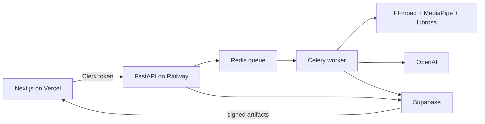

# it'sPEAK

it'sPEAK is a private web coach for practising presentations, pitches, interviews, conferences, and keynote-style talks. Users upload an English-language video of up to three minutes and receive evidence-based feedback on vocal and visual delivery.

[Live app](https://it-s-peak-ruddy.vercel.app/sign-in) · [Demo video](https://youtu.be/p2i9zemDgSw) · [API documentation](https://it-speak-production.up.railway.app/docs)

## Features

- Clerk-authenticated project folders and private sessions.
- Quality checks for framing, lighting, face visibility, audio, silence, clipping, and duration.
- Librosa YIN analysis for pacing, pitch variation, fillers, and pauses.
- MediaPipe analysis for eye contact, expression, posture, gestures, movement, and spatial use.
- OpenAI transcription and grounded coaching with deterministic coaching fallbacks.
- Six speaking archetypes with calibrated scoring.
- Five retained sessions per project; Session 1 is the protected baseline.
- Progress charts, editable transcripts, synchronized overlays, and an eye-contact timeline.
- Private Supabase reports and artifacts exposed through short-lived signed URLs.

Results describe observable rehearsal signals. They are not medical, psychological, personality, anxiety, or employment assessments.

## Architecture



## Repository

```text
backend/              FastAPI, Celery, analysis, persistence, and tests
frontend/             Next.js application and tests
scripts/              Local service supervisor
supabase/migrations/  Ordered database migrations
```

See the [backend guide](backend/README.md) and [frontend guide](frontend/README.md) for component-specific details.

## Local setup

Requirements: Node.js 20+, Python 3.11, FFmpeg/ffprobe, Redis, and Clerk, Supabase, and OpenAI credentials.

```bash
cd backend
python3.11 -m venv .venv
.venv/bin/python -m pip install -r requirements.txt
cp .env.example .env

cd ../frontend
npm ci
cp .env.example .env.local
cd ..
```

Configure both environment files. Frontend and backend Clerk keys must belong to the same Clerk application, and secrets must never use a `NEXT_PUBLIC_*` prefix.

For a new Supabase project, either:

- run `backend/persistence/schema.sql` once in the SQL Editor; or
- run `supabase link --project-ref YOUR_PROJECT_REF` followed by `supabase db push`.

Do not rerun the consolidated schema over an existing database; apply only its unapplied files from `supabase/migrations/`.

Start the services in separate terminals:

```bash
npm run backend
npm run dev
```

Open `http://localhost:3000`. FastAPI health and documentation are available at `http://localhost:8000/healthz` and `http://localhost:8000/docs`.

## Verification

```bash
npm test
npm run build
cd backend
.venv/bin/python -m unittest discover -s tests -v
```

## Production

- Frontend: Vercel, root directory `frontend/`.
- Backend: Railway Docker service, root directory `backend/`.
- Redis: managed Railway Redis.
- Persistent volume: mount `/data` and set `ITSPEAK_ARTIFACT_DIR=/data/itspeak-sessions`.
- Keep one backend replica and `CELERY_WORKER_CONCURRENCY=1`.

The production Celery worker processes one analysis at a time and restarts after each full analysis to release MediaPipe and Librosa memory. Queued jobs remain in Redis. Temporary local artifacts expire after 24 hours; successful reports, videos, and landmarks remain in Supabase.

## Limits

- English-language videos only.
- Maximum duration of three minutes per video.
- Maximum of five retained sessions per project.
- Session 1 cannot be replaced.
- Pending uploads require the API and worker to share the mounted artifact directory.
