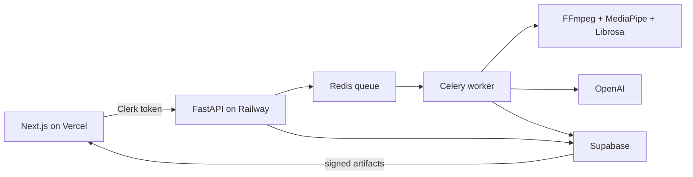

# it'sPEAK

it'sPEAK is a private web coach for practising presentations, pitches, interviews, conferences, and keynote-style talks. Users upload an English-language video of up to three minutes and receive evidence-based feedback on vocal and visual delivery.

[Live app](https://it-s-peak-ruddy.vercel.app/sign-in) · [Demo video](https://youtu.be/p2i9zemDgSw) · [API documentation](https://it-speak-production.up.railway.app/docs)

## Features

- Clerk-authenticated project folders and private sessions.
- Quality checks for framing, lighting, face visibility, audio, silence, clipping, and duration.
- Librosa YIN analysis for pacing, pitch variation, fillers, and pauses.
- MediaPipe analysis for eye contact, expression, posture, gestures, movement, and spatial use.
- OpenAI transcription and grounded coaching with deterministic coaching fallbacks.
- Six speaking archetypes with calibrated scoring.
- Five retained sessions per project; Session 1 is the protected baseline.
- Progress charts, editable transcripts, synchronized overlays, and an eye-contact timeline.
- Private Supabase reports and artifacts exposed through short-lived signed URLs.

Results describe observable rehearsal signals. They are not medical, psychological, personality, anxiety, or employment assessments.

## Architecture



## Repository

```text
backend/              FastAPI, Celery, analysis, persistence, and tests
frontend/             Next.js application and tests
scripts/              Local service supervisor
supabase/migrations/  Ordered database migrations
```

See the [backend guide](backend/README.md) and [frontend guide](frontend/README.md) for component-specific details.

## Local setup

Requirements: Node.js 20+, Python 3.11, FFmpeg/ffprobe, Redis, and Clerk, Supabase, and OpenAI credentials.

```bash
cd backend
python3.11 -m venv .venv
.venv/bin/python -m pip install -r requirements.txt
cp .env.example .env

cd ../frontend
npm ci
cp .env.example .env.local
cd ..
```

Configure both environment files. Frontend and backend Clerk keys must belong to the same Clerk application, and secrets must never use a `NEXT_PUBLIC_*` prefix.

For a new Supabase project, either:

- run `backend/persistence/schema.sql` once in the SQL Editor; or
- run `supabase link --project-ref YOUR_PROJECT_REF` followed by `supabase db push`.

Do not rerun the consolidated schema over an existing database; apply only its unapplied files from `supabase/migrations/`.

Start the services in separate terminals:

```bash
npm run backend
npm run dev
```

Open `http://localhost:3000`. FastAPI health and documentation are available at `http://localhost:8000/healthz` and `http://localhost:8000/docs`.

## Verification

```bash
npm test
npm run build
cd backend
.venv/bin/python -m unittest discover -s tests -v
```

## Cloud deployment

The hosted application uses Supabase, Clerk, Railway, and Vercel. Deploy from `main`.

### 1. Prepare Supabase and Clerk

1. Create a Supabase project, then apply the schema:

   ```bash
   supabase login
   supabase link --project-ref YOUR_PROJECT_REF
   supabase db push
   ```

2. Create a Clerk production instance and configure its production domain and sign-in/sign-up URLs.
3. Keep the Clerk production publishable and secret keys available for both deployments.

### 2. Deploy the backend on Railway

1. Create a Railway project and add a managed Redis service.
2. Add a service from this GitHub repository with:
   - branch: `main`;
   - root directory: `/backend`;
   - builder: `Dockerfile`;
   - health-check path: `/healthz`;
   - one replica.
3. Attach a persistent volume to the backend service at `/data`.
4. Add these Railway variables:

   ```env
   ITSPEAK_ENVIRONMENT=production
   ITSPEAK_REDIS_URL=${{Redis.REDIS_URL}}
   ITSPEAK_FRONTEND_ORIGIN=https://YOUR_VERCEL_DOMAIN
   ITSPEAK_ARTIFACT_DIR=/data/itspeak-sessions
   CELERY_WORKER_CONCURRENCY=1
   CLERK_SECRET_KEY=YOUR_CLERK_SECRET_KEY
   ITSPEAK_SUPABASE_URL=YOUR_SUPABASE_URL
   ITSPEAK_SUPABASE_SECRET_KEY=YOUR_SUPABASE_SECRET_KEY
   ITSPEAK_SUPABASE_STORAGE_BUCKET=session-artifacts
   ITSPEAK_OPENAI_API_KEY=YOUR_OPENAI_API_KEY
   ```

   If the Redis service has a different name, use its generated `REDIS_URL` reference instead.

5. Deploy, generate a public Railway domain, and verify:

   ```bash
   curl --fail https://YOUR_RAILWAY_DOMAIN/healthz
   ```

### 3. Deploy the frontend on Vercel

1. Import the same GitHub repository into Vercel.
2. Configure:
   - root directory: `frontend`;
   - install command: `npm ci`;
   - build command: `npm run build`;
   - production branch: `main`;
   - output directory: leave unset.
3. Add these production variables:

   ```env
   NEXT_PUBLIC_API_URL=https://YOUR_RAILWAY_DOMAIN
   NEXT_PUBLIC_CLERK_PUBLISHABLE_KEY=YOUR_CLERK_PUBLISHABLE_KEY
   CLERK_SECRET_KEY=YOUR_CLERK_SECRET_KEY
   ```

4. Deploy and copy the production Vercel URL.
5. Set Railway `ITSPEAK_FRONTEND_ORIGIN` to that exact origin, without a trailing path, and redeploy the backend.
6. Confirm the same Vercel domain and production Clerk keys are configured in Clerk.

### 4. Verify production

- Open `/sign-in` while signed out.
- Confirm `/` redirects to sign-in.
- Create a project and complete one authenticated video analysis.
- Confirm the report remains available after restarting the Railway service.

The worker processes one analysis at a time and restarts after each full analysis to release MediaPipe and Librosa memory. Queued jobs remain in Redis. Temporary local artifacts expire after 24 hours; successful reports, videos, and landmarks remain in Supabase.

Provider references: [Railway Dockerfiles](https://docs.railway.com/builds/dockerfiles), [Railway volumes](https://docs.railway.com/volumes), [Vercel monorepos](https://vercel.com/docs/monorepos), [Clerk production deployment](https://clerk.com/docs/guides/development/deployment/production), and [Supabase migrations](https://supabase.com/docs/guides/deployment/database-migrations).

## Limits

- English-language videos only.
- Maximum duration of three minutes per video.
- Maximum of five retained sessions per project.
- Session 1 cannot be replaced.
- Pending uploads require the API and worker to share the mounted artifact directory.
