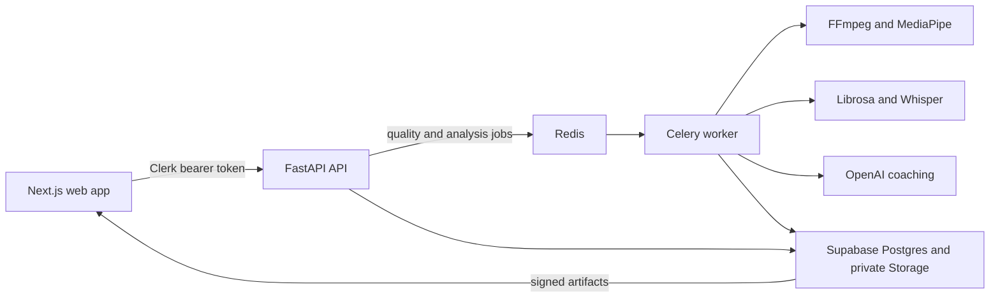

# it'sPEAK

it'sPEAK is a web-based public-speaking coach for university students and early-career professionals preparing for presentations, pitches, interviews, conferences, and keynote-style talks.

Users create a rehearsal project, choose vocal and visual improvement areas, and upload an English-language presentation video of up to three minutes. The application checks recording quality, analyses observable vocal delivery, facial presence, and body language, and turns the results into prioritised coaching actions across retained rehearsal sessions.

## Demo

> **Demo video:** [Watch the it'sPEAK demo](DEMO_VIDEO_URL) — replace `DEMO_VIDEO_URL` when the public recording is available.

## What the application provides

- Clerk-authenticated private user accounts.
- Project folders with selected audio and visual improvement areas.
- A pre-analysis quality gate for lighting, framing, face visibility, audio level, clipping, silence, and video duration.
- Asynchronous analysis through FastAPI, Celery, and Redis.
- Vocal analysis for pacing, intonation, filler words, pauses, and transcript quality.
- Visual analysis for eye contact, facial expressions, posture, gestures, movement, and spatial use.
- Archetype-calibrated scores and actionable OpenAI coaching with deterministic fallbacks.
- Private Supabase persistence for projects, reports, videos, and landmark artifacts.
- Up to five retained sessions per project, with Session 1 protected as the baseline.
- Synchronized video review, landmarks, eye-contact intervals, coaching priorities, and progress charts.

The measurements describe observable delivery. They are not medical, psychological, personality, anxiety, or employment assessments.

## Architecture



Clerk owns authentication. The browser sends short-lived Clerk session tokens to FastAPI, and FastAPI owns all Supabase database and Storage access. Clerk and Supabase secret keys must never be exposed through `NEXT_PUBLIC_*` variables.

## Repository layout

```text
.
├── backend/                 # FastAPI, Celery, analysis, persistence, and tests
├── frontend/                # Next.js web application and frontend tests
├── scripts/                 # Monorepo service supervisor
├── supabase/migrations/     # Incremental upgrades for existing databases
├── package.json             # Root convenience commands
└── README.md
```

Operational documentation:

- [Frontend operational guide](frontend/README.md)
- [Backend operational guide](backend/README.md)

## Prerequisites

First-time setup needs local tools **and** three cloud accounts (Clerk, Supabase, OpenAI). Create the accounts before filling environment files — empty keys produce sign-in loops, `401`/`503` responses, or failed uploads that look like app bugs.

### Local software

| Requirement | Version | Purpose |
| --- | --- | --- |
| Git | Current stable | Clone and manage the repository |
| Node.js | 20 or newer | Run Next.js and the backend supervisor |
| npm | Bundled with Node.js | Install and run frontend dependencies |
| Python | 3.11 | Run FastAPI, Celery, MediaPipe, Librosa, and tests |
| FFmpeg and ffprobe | Current stable | Validate and decode uploaded media |
| Redis | 7 recommended | Celery broker and task state |
| Docker Desktop | Current stable (Windows) | Recommended way to run Redis on Windows |

### External services

| Service | Required for | Credential location |
| --- | --- | --- |
| Clerk | Sign-in and API authentication | Frontend and backend environment files |
| Supabase | Projects, sessions, reports, and private artifacts | Backend environment file |
| OpenAI | Live transcription and generated coaching | Backend environment file |

The Supabase CLI is optional. Use it to link the project and apply migrations, or paste SQL through the Supabase SQL Editor. Install it from the [Supabase CLI docs](https://supabase.com/docs/guides/cli) only if you prefer `supabase db push`.

### Create the cloud accounts

Complete these once per developer machine / team project. Use the **same** Clerk instance in both `frontend/.env.local` and `backend/.env`.

#### 1. Clerk

1. Create an application at [clerk.com](https://clerk.com).
2. In **API Keys**, copy the **Publishable key** and **Secret key**.
3. In **Configure → Domains / Paths** (wording varies by Clerk UI), allow local development:
   - Application / home URL: `http://localhost:3000`
   - Sign-in URL: `http://localhost:3000/sign-in`
   - Sign-up URL: `http://localhost:3000/sign-up`
4. Put the publishable key in `frontend/.env.local` as `NEXT_PUBLIC_CLERK_PUBLISHABLE_KEY`.
5. Put the **same** secret key in both `frontend/.env.local` (`CLERK_SECRET_KEY`) and `backend/.env` (`CLERK_SECRET_KEY`).

Mismatched Clerk instances between frontend and backend are the most common cause of local `401` responses.

#### 2. Supabase

1. Create a project at [supabase.com](https://supabase.com).
2. From **Project Settings → API**, copy:
   - **Project URL** → `ITSPEAK_SUPABASE_URL`
   - **service_role** (secret) key → `ITSPEAK_SUPABASE_SECRET_KEY`  
     Never put the service role key in any `NEXT_PUBLIC_*` variable.
3. Apply the database schema next (see [Apply the Supabase schema](#apply-the-supabase-schema)). That step also creates the private `session-artifacts` storage bucket.

#### 3. OpenAI

1. Create an API key at [platform.openai.com](https://platform.openai.com).
2. Put it in `backend/.env` as `ITSPEAK_OPENAI_API_KEY`.
3. The backend uses Whisper for transcription and a chat model for coaching; without this key, uploads may pass the quality gate but full analysis will fail.

### Install system prerequisites

macOS with Homebrew:

```bash
brew install git node python@3.11 ffmpeg redis
brew services start redis
```

Linux package names vary by distribution. Install Git, Node.js 20+, Python 3.11 with venv support, FFmpeg, and Redis through the distribution package manager or the vendors' supported installers, then start Redis so it listens on `127.0.0.1:6379`.

Windows with winget and Docker Desktop:

1. Install [Docker Desktop for Windows](https://www.docker.com/products/docker-desktop/) and leave it running.
2. Install the other tools, then start Redis in Docker:

```powershell
winget install Git.Git
winget install OpenJS.NodeJS.LTS
winget install Python.Python.3.11
winget install Gyan.FFmpeg
docker run -d -p 6379:6379 --name itspeak-redis redis:7
```

On later sessions, if the container already exists:

```powershell
docker start itspeak-redis
```

Memurai can replace Docker Redis on Windows. The backend supervisor **reuses** any Redis-compatible service already responding at `ITSPEAK_REDIS_URL`. If nothing is listening, it tries to spawn a local `redis-server` / `redis-server.exe`, which most Windows machines do **not** have — so Windows developers should keep Docker Redis (or Memurai) running before `npm run backend`.

Confirm the required executables are available before installing the application.

macOS/Linux:

```bash
git --version
node --version
npm --version
python3.11 --version
ffmpeg -version
ffprobe -version
redis-cli ping
```

Windows PowerShell:

```powershell
git --version
node --version
npm --version
py -3.11 --version
ffmpeg -version
ffprobe -version
docker exec itspeak-redis redis-cli ping
```

Expect `PONG` from the Redis check. If FFmpeg is not on `PATH`, set absolute paths with `ITSPEAK_FFMPEG_BIN` and `ITSPEAK_FFPROBE_BIN` in `backend/.env`.

## Install

Run these commands from the repository root. Root `package.json` has no npm dependencies; you only install Python packages under `backend/` and Node packages under `frontend/`.

macOS/Linux:

```bash
cd backend
python3.11 -m venv .venv
.venv/bin/python -m pip install --upgrade pip
.venv/bin/python -m pip install -r requirements.txt
cd ../frontend
npm ci
cd ..
```

Windows PowerShell:

```powershell
cd backend
py -3.11 -m venv .venv
.\.venv\Scripts\python.exe -m pip install --upgrade pip
.\.venv\Scripts\python.exe -m pip install -r requirements.txt
cd ..\frontend
npm ci
cd ..
```

## Configure the environment

The frontend and backend use separate environment files.

macOS/Linux:

```bash
cp frontend/.env.example frontend/.env.local
cp backend/.env.example backend/.env
```

Windows PowerShell:

```powershell
Copy-Item frontend/.env.example frontend/.env.local
Copy-Item backend/.env.example backend/.env
```

Then fill in the Clerk, Supabase, and OpenAI values from [Create the cloud accounts](#create-the-cloud-accounts).

### `frontend/.env.local`

| Variable | Requirement | Purpose |
| --- | --- | --- |
| `NEXT_PUBLIC_API_URL` | Recommended | FastAPI base URL; defaults to `http://localhost:8000` |
| `NEXT_PUBLIC_CLERK_PUBLISHABLE_KEY` | Required | Public Clerk browser key |
| `CLERK_SECRET_KEY` | Required | Server-only Clerk key used by Next.js middleware |
| `NEXT_PUBLIC_SUPABASE_URL` | Not used by the current web flow | Reserved public Supabase value |
| `NEXT_PUBLIC_SUPABASE_PUBLISHABLE_KEY` | Not used by the current web flow | Reserved public Supabase value |

### `backend/.env`

| Variable | Requirement | Purpose |
| --- | --- | --- |
| `ITSPEAK_FRONTEND_ORIGIN` | Required | Exact frontend origin, normally `http://localhost:3000` |
| `CLERK_SECRET_KEY` | Required | Verify Clerk session tokens; use the same Clerk instance as the frontend |
| `CLERK_JWT_KEY` | Optional | PEM public key for local JWT verification; otherwise Clerk JWKS is used |
| `ITSPEAK_SUPABASE_URL` | Required | Supabase project URL |
| `ITSPEAK_SUPABASE_SECRET_KEY` | Required | Backend-only **service_role** key for database and Storage |
| `ITSPEAK_SUPABASE_PUBLISHABLE_KEY` | Optional | Public Supabase value retained for configuration compatibility |
| `ITSPEAK_SUPABASE_STORAGE_BUCKET` | Optional | Private bucket name; defaults to `session-artifacts` |
| `ITSPEAK_REDIS_URL` | Required service | Celery connection; defaults to `redis://localhost:6379/0` |
| `ITSPEAK_OPENAI_API_KEY` | Required for full analysis | Live transcription and generated coaching |
| `ITSPEAK_ARTIFACT_DIR` | **Required on Windows** | Writable folder for pending uploads; see below |

**Windows — set a local artifact directory** (do not leave the Unix default `/tmp/itspeak-sessions`):

```env
ITSPEAK_ARTIFACT_DIR=C:\Users\YOUR_USERNAME\AppData\Local\itspeak-sessions
```

Also set `ITSPEAK_FFMPEG_BIN` and `ITSPEAK_FFPROBE_BIN` to the full `.exe` paths when `ffmpeg` / `ffprobe` are not on `PATH`.

## Apply the Supabase schema

Pick **one** path. Do not mix them on the same project.

### Option A — new empty Supabase project (recommended for first clone)

Open the Supabase **SQL Editor** and run the consolidated master schema **once**:

`backend/persistence/schema.sql`

That file creates tables, RLS policies, archetype seeds (including current scoring bands), and the private `session-artifacts` bucket. Do **not** paste only the `insert into public.archetype_configs ...` block from an older migration file — those historical seeds may lag behind the master schema.

### Option B — Supabase CLI (also fine for a new empty project)

Install the [Supabase CLI](https://supabase.com/docs/guides/cli), then from the repository root:

```bash
supabase link --project-ref YOUR_PROJECT_REF
supabase db push
```

`db push` applies every file under `supabase/migrations/` in order. That includes the initial schema **and** later upgrades (for example posture band recalibrations). Prefer this over copying individual `INSERT` snippets by hand.

### Option C — existing database that already has tables

Apply only the **unapplied** timestamped upgrades under `supabase/migrations/`. Do **not** rerun `backend/persistence/schema.sql` over an existing database (it is a full bootstrap, not an incremental patch).

After applying schema, you can confirm posture bands look current with:

```sql
select archetype_key, scoring_config->'posture' as posture
from public.archetype_configs
order by archetype_key;
```

## Run locally

Open two terminals at the repository root after installation, environment configuration, and schema setup. On Windows, confirm Docker Desktop is running and `docker start itspeak-redis` has succeeded before starting the backend.

Terminal 1 — complete backend:

```bash
npm run backend
```

Terminal 2 — frontend:

```bash
npm run dev
```

Open [http://localhost:3000](http://localhost:3000). The API health endpoint is [http://localhost:8000/healthz](http://localhost:8000/healthz).

Press `Ctrl+C` in each terminal to stop the application. The backend supervisor stops FastAPI, the Celery worker, Celery Beat, and any Redis process it started. It intentionally leaves a previously running Redis service (including the Docker `itspeak-redis` container) untouched.

For individual commands and diagnostics, use the [frontend guide](frontend/README.md) and [backend guide](backend/README.md).

## Deploy the backend container

The production image under `backend/` runs FastAPI, one Celery worker, and one
Celery Beat scheduler under Supervisor. Keeping them in one service is
intentional: pending uploads are filesystem-backed, so the API and worker must
share the same persistent artifact volume.

On the selected container platform:

1. Create a Docker service from this repository, using `backend/` as the root
   directory and `Dockerfile` as the Dockerfile path. Use the `linux/amd64`
   architecture required by the pinned MediaPipe release.
2. Create a managed Redis service with persistence enabled.
3. Mount persistent storage at `/data` and keep the service at exactly one
   replica.
4. Set the health-check path to `/healthz`. The platform supplies `PORT`; the
   container binds FastAPI to `0.0.0.0:$PORT`.
5. Add the production environment variables listed in the
   [backend deployment guide](backend/README.md#production-container).
6. Deploy `main`, then confirm the logs show the API, worker, and Beat processes
   running before exercising a real upload.

Do not deploy the API and worker as isolated services with separate filesystems.
Successful artifacts are committed to Supabase Storage, but pending analysis
jobs still require their shared mounted directory.

## Current boundaries

- Recordings must be English-language videos no longer than three minutes.
- Session 1 is the protected baseline; each project retains at most five successful sessions.
- Failed and pending local artifacts expire after 24 hours.
- Only enabled archetypes may be selected for scored analysis.
- Results report observable rehearsal signals and must not be treated as emotion, personality, medical, psychological, or employment inference.
