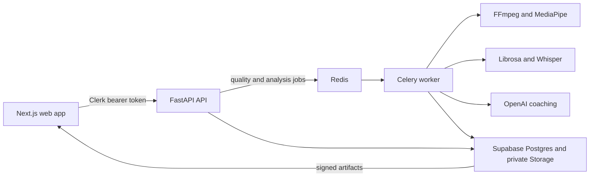

# it'sPEAK

it'sPEAK is a web-based public-speaking coach for university students and early-career professionals preparing for presentations, pitches, interviews, conferences, and keynote-style talks.

Users create a rehearsal project, choose vocal and visual improvement areas, and upload an English-language presentation video of up to three minutes. The application checks recording quality, analyses observable vocal delivery, facial presence, and body language, and turns the results into prioritised coaching actions across retained rehearsal sessions.

## Demo

> **Demo video:** [Watch the it'sPEAK demo](DEMO_VIDEO_URL) — replace `DEMO_VIDEO_URL` when the public recording is available.

## What the application provides

- Clerk-authenticated private user accounts.
- Project folders with selected audio and visual improvement areas.
- A pre-analysis quality gate for lighting, framing, face visibility, audio level, clipping, silence, and video duration.
- Asynchronous analysis through FastAPI, Celery, and Redis.
- Vocal analysis for pacing, intonation, filler words, pauses, and transcript quality.
- Visual analysis for eye contact, facial expressions, posture, gestures, movement, and spatial use.
- Archetype-calibrated scores and actionable OpenAI coaching with deterministic fallbacks.
- Private Supabase persistence for projects, reports, videos, and landmark artifacts.
- Up to five retained sessions per project, with Session 1 protected as the baseline.
- Synchronized video review, landmarks, eye-contact intervals, coaching priorities, and progress charts.

The measurements describe observable delivery. They are not medical, psychological, personality, anxiety, or employment assessments.

## Architecture



Clerk owns authentication. The browser sends short-lived Clerk session tokens to FastAPI, and FastAPI owns all Supabase database and Storage access. Clerk and Supabase secret keys must never be exposed through `NEXT_PUBLIC_*` variables.

## Repository layout

```text
.
├── backend/                 # FastAPI, Celery, analysis, persistence, and tests
├── frontend/                # Next.js web application and frontend tests
├── scripts/                 # Monorepo service supervisor
├── supabase/migrations/     # Incremental upgrades for existing databases
├── package.json             # Root convenience commands
└── README.md
```

Operational documentation:

- [Frontend operational guide](frontend/README.md)
- [Backend operational guide](backend/README.md)

## Prerequisites

### Local software

| Requirement | Version | Purpose |
| --- | --- | --- |
| Git | Current stable | Clone and manage the repository |
| Node.js | 20 or newer | Run Next.js and the backend supervisor |
| npm | Bundled with Node.js | Install and run frontend dependencies |
| Python | 3.11 | Run FastAPI, Celery, MediaPipe, Librosa, and tests |
| FFmpeg and ffprobe | Current stable | Validate and decode uploaded media |
| Redis | 7 recommended | Celery broker and task state |

### External services

| Service | Required for | Credential location |
| --- | --- | --- |
| Clerk | Sign-in and API authentication | Frontend and backend environment files |
| Supabase | Projects, sessions, reports, and private artifacts | Backend environment file |
| OpenAI | Live transcription and generated coaching | Backend environment file |

The Supabase CLI is optional. Use it to link the project and apply migrations, or apply the SQL through the Supabase SQL Editor.

### Install system prerequisites

macOS with Homebrew:

```bash
brew install git node python@3.11 ffmpeg redis
```

Linux package names vary by distribution. Install Git, Node.js 20+, Python 3.11 with venv support, FFmpeg, and Redis through the distribution package manager or the vendors' supported installers.

Windows with winget and Docker Desktop:

```powershell
winget install Git.Git
winget install OpenJS.NodeJS.LTS
winget install Python.Python.3.11
winget install Gyan.FFmpeg
docker run -d -p 6379:6379 --name itspeak-redis redis:7
```

Memurai can replace Docker Redis on Windows. The backend supervisor reuses any Redis-compatible service already responding at the configured address.

Confirm the required executables are available before installing the application:

```bash
git --version
node --version
npm --version
python3.11 --version
ffmpeg -version
ffprobe -version
redis-server --version
```

On Windows, use `py -3.11 --version`. If FFmpeg is not on `PATH`, configure the absolute executable paths in `backend/.env`.

## Install

Run these commands from the repository root.

macOS/Linux:

```bash
cd backend
python3.11 -m venv .venv
.venv/bin/python -m pip install --upgrade pip
.venv/bin/python -m pip install -r requirements.txt
cd ../frontend
npm ci
cd ..
```

Windows PowerShell:

```powershell
cd backend
py -3.11 -m venv .venv
.\.venv\Scripts\python.exe -m pip install --upgrade pip
.\.venv\Scripts\python.exe -m pip install -r requirements.txt
cd ..\frontend
npm ci
cd ..
```

## Configure the environment

The frontend and backend use separate environment files.

macOS/Linux:

```bash
cp frontend/.env.example frontend/.env.local
cp backend/.env.example backend/.env
```

Windows PowerShell:

```powershell
Copy-Item frontend/.env.example frontend/.env.local
Copy-Item backend/.env.example backend/.env
```

### `frontend/.env.local`

| Variable | Requirement | Purpose |
| --- | --- | --- |
| `NEXT_PUBLIC_API_URL` | Recommended | FastAPI base URL; defaults to `http://localhost:8000` |
| `NEXT_PUBLIC_CLERK_PUBLISHABLE_KEY` | Required | Public Clerk browser key |
| `CLERK_SECRET_KEY` | Required | Server-only Clerk key used by Next.js middleware |
| `NEXT_PUBLIC_SUPABASE_URL` | Not used by the current web flow | Reserved public Supabase value |
| `NEXT_PUBLIC_SUPABASE_PUBLISHABLE_KEY` | Not used by the current web flow | Reserved public Supabase value |

### `backend/.env`

| Variable | Requirement | Purpose |
| --- | --- | --- |
| `ITSPEAK_FRONTEND_ORIGIN` | Required | Exact frontend origin, normally `http://localhost:3000` |
| `CLERK_SECRET_KEY` | Required | Verify Clerk session tokens; use the same Clerk instance as the frontend |
| `CLERK_JWT_KEY` | Optional | PEM public key for local JWT verification; otherwise Clerk JWKS is used |
| `ITSPEAK_SUPABASE_URL` | Required | Supabase project URL |
| `ITSPEAK_SUPABASE_SECRET_KEY` | Required | Backend-only database and Storage credential |
| `ITSPEAK_SUPABASE_PUBLISHABLE_KEY` | Optional | Public Supabase value retained for configuration compatibility |
| `ITSPEAK_SUPABASE_STORAGE_BUCKET` | Optional | Private bucket name; defaults to `session-artifacts` |
| `ITSPEAK_REDIS_URL` | Required service | Celery connection; defaults to `redis://localhost:6379/0` |
| `ITSPEAK_OPENAI_API_KEY` | Required for full analysis | Live transcription and generated coaching |

On Windows, set `ITSPEAK_ARTIFACT_DIR` to a Windows path and configure `ITSPEAK_FFMPEG_BIN` and `ITSPEAK_FFPROBE_BIN` when the executables are not on `PATH`.

## Apply the Supabase schema

With the Supabase CLI installed:

```bash
supabase link --project-ref YOUR_PROJECT_REF
supabase db push
```

For a new empty project, run the consolidated master schema at `backend/persistence/schema.sql` once in the Supabase SQL Editor. For an existing database, apply only the unapplied timestamped upgrades under `supabase/migrations/`; do not rerun the master schema over existing tables.

## Run locally

Open two terminals at the repository root after installation and configuration.

Terminal 1 — complete backend:

```bash
npm run backend
```

Terminal 2 — frontend:

```bash
npm run dev
```

Open [http://localhost:3000](http://localhost:3000). The API health endpoint is [http://localhost:8000/healthz](http://localhost:8000/healthz).

Press `Ctrl+C` in each terminal to stop the application. The backend supervisor stops FastAPI, the Celery worker, Celery Beat, and any Redis process it started. It intentionally leaves a previously running Redis service untouched.

For individual commands and diagnostics, use the [frontend guide](frontend/README.md) and [backend guide](backend/README.md).

## Current boundaries

- Recordings must be English-language videos no longer than three minutes.
- Session 1 is the protected baseline; each project retains at most five successful sessions.
- Failed and pending local artifacts expire after 24 hours.
- Only enabled archetypes may be selected for scored analysis.
- Results report observable rehearsal signals and must not be treated as emotion, personality, medical, psychological, or employment inference.
